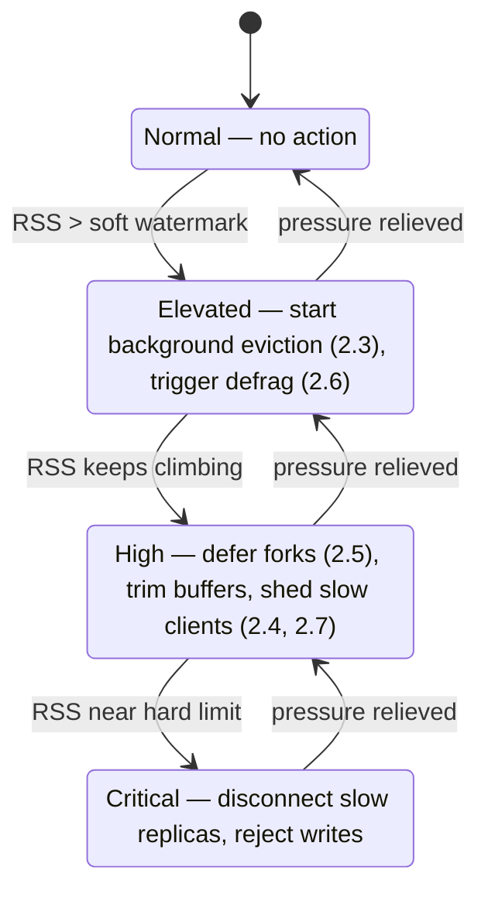

# Design Document: OOM Reduction

## 1. Overview

Valkey processes are killed by the kernel, or start rejecting writes with `OOM
command not allowed`, far more often than the size of the dataset alone would
explain. This document identifies the causes, groups them by root cause, and
proposes a design for each.

The central observation is an **accounting gap**:

> Valkey enforces `maxmemory` against `zmalloc_used_memory()` — the allocator's
> view of live allocations. The Linux kernel terminates processes based on RSS —
> the resident page count. Every byte that lives in the difference between those
> two numbers is memory Valkey cannot see itself using, but which can still get
> it killed.

Most of the failure modes below are instances of that gap. The design therefore
centers on a single new component — an **RSS-aware memory governor** — with
targeted fixes layered on top.

```
   RSS (what the kernel kills on)
   ├── zmalloc_used_memory()          <- the ONLY thing maxmemory bounds
   │   ├── dataset
   │   └── client buffers (partially bounded by maxmemory-clients)
   ├── allocator fragmentation        <- unbounded, activedefrag off by default
   ├── replication buffer > backlog   <- deliberately subtracted from accounting
   ├── AOF buffer                     <- deliberately subtracted
   ├── slot export buffers            <- deliberately subtracted
   └── fork copy-on-write pages       <- up to 2x, no admission control
```

## 2. Causes and Solutions

### 2.1 No memory limit is configured

`maxmemory` defaults to `0` (unlimited). A Valkey process in a container grows
until the cgroup limit is reached and the kernel OOM-kills it, losing the entire
dataset. Nothing in the codebase reads the cgroup limit; the only cgroup
references in `src/` are Stream consumer groups.

This is the single most common cause of hard OOM kills, and the most
mechanically fixable.

**Solution: cgroup-aware default limit.**

At startup, when `maxmemory == 0`, read the effective container limit:

1. cgroup v2: `/sys/fs/cgroup/memory.max`
2. cgroup v1: `/sys/fs/cgroup/memory/memory.limit_in_bytes`
3. Fall back to total system RAM.

Derive a default `maxmemory` that reserves headroom for the non-dataset regions
listed in the diagram above:

```
maxmemory_default = (container_limit - fork_reserve) * dataset_fraction
```

The reserve exists because `maxmemory` bounds only one of the six RSS
contributors. The server logs the derived value and its inputs at startup, and
exposes it in `INFO memory` as a distinct field so operators can tell a derived
limit from a configured one. An explicit `maxmemory` in the config always wins;
this only replaces the "unlimited" default.

### 2.2 `noeviction` default and keys without TTL

`maxmemory-policy` defaults to `MAXMEMORY_NO_EVICTION`
([`config.c:3354`](../src/config.c)). Once the limit is reached, every write is
rejected. For a cache workload this converts a memory problem into a total write
outage. Keys written without a TTL accumulate indefinitely, so the limit is
reached eventually rather than never.

`noeviction` is the correct default for a datastore and the wrong default for a
cache, and the server cannot tell which it is. Rather than changing the default —
which would silently start discarding data for datastore users — the server
should make the wrong configuration visible before it becomes an outage.

**Solution: pressure telemetry and a startup warning.**

- Emit a startup warning when `maxmemory > 0` and `maxmemory-policy` is
  `noeviction`, naming the tradeoff.
- Track the fraction of keys carrying a TTL. Under `volatile-*` policies, an
  instance with no volatile keys cannot evict anything at all — `performEvictions`
  fails and every write is rejected. Surface this as an `INFO` field and warn
  when a `volatile-*` policy is paired with a near-empty expires table.

### 2.3 Eviction is reactive and in the command path

`performEvictions()` is called from `processCommand()`
([`server.c:4512`](../src/server.c)) only once the limit has already been
breached. Freeing memory therefore happens synchronously, on the hot path, at
the moment of maximum pressure. Two consequences: a latency spike proportional
to how far over the limit the server drifted, and — when eviction cannot keep up
— a write rejection.

**Solution: graduated background eviction.**

Introduce a soft watermark below `maxmemory`. When `used_memory` crosses it,
`serverCron` begins evicting incrementally in the background, well before the
hard limit. The existing `evictionTimeProc` machinery
([`evict.c:323`](../src/evict.c)) already spins the event loop with short
eviction cycles and can be driven from the watermark instead of only from the
breach.

```
0%                          soft watermark        maxmemory
├──────────────────────────────────┼──────────────────┤
        no action                  │  background      │ synchronous
                                   │  eviction        │ eviction +
                                   │  (cron)          │ write rejection
```

The hard-limit path remains as a backstop. The soft watermark converts a cliff
into a slope.

### 2.4 Unaccounted buffers: replication, AOF, slot export

`freeMemoryGetNotCountedMemory()` ([`evict.c:200`](../src/evict.c)) deliberately
subtracts three regions from the memory that `maxmemory` bounds:

- the replication buffer, to the extent it exceeds `repl-backlog-size`
- the AOF buffer
- cluster slot export buffers

The rationale is sound and documented in place: these buffers grow *because* of
eviction (evicting keys generates `DEL`s, which are propagated, which grows the
replication buffer, which triggers more eviction). Counting them would create a
resonance loop that evicts the entire keyspace.

But "not counted for eviction" has been conflated with "not bounded at all."
These are real resident pages. A slow replica, a stalled AOF fsync, or a large
slot migration grows them without limit, and the kernel does not care that
Valkey excluded them from its own arithmetic. This is the mechanism behind the
widely reported replica `qbuf` growth to multi-gigabyte sizes.

**Solution: bound them without counting them.**

Keep these regions out of the eviction calculation — the resonance argument
still holds — but give them an explicit ceiling enforced by backpressure rather
than by eviction:

| Region | Ceiling breached ⇒ action |
| --- | --- |
| Replication buffer | Disconnect the slowest replica (existing output-buffer-limit path), before RSS is threatened rather than after |
| AOF buffer | Throttle writes / force an fsync rather than accumulate |
| Slot export buffer | Pause the migration |

The governor (§3) owns the ceiling and sizes it from the RSS headroom actually
available, instead of from a static per-region config that operators must sum
themselves and keep consistent with `maxmemory`.

### 2.5 Fork copy-on-write

`serverFork()` ([`server.c:7093`](../src/server.c)) forks unconditionally. Under
copy-on-write, every page the parent writes while the child lives is duplicated;
a write-heavy instance mid-`BGSAVE` approaches 2x RSS. The child already lowers
its OOM score and calls `dismissMemoryInChild()`, which reduces the damage but
does not prevent the fork from being attempted when there is no headroom for it.

**Solution: fork admission control.**

Before forking, estimate the COW cost from the recent write rate and the
expected child lifetime, and compare it against measured RSS headroom. Then
classify the fork:

- **Deferrable** (scheduled `BGSAVE`, AOF rewrite): postpone and retry, logging
  the reason. A delayed snapshot is strictly better than a dead process.
- **Non-deferrable** (replica full sync): never refuse. Prefer diskless
  replication and apply write throttling to shrink the COW working set for the
  duration.

`vm.overcommit_memory=1` remains necessary — without it `fork()` itself fails —
but it is a precondition, not a solution: it lets the fork succeed and moves the
failure to the OOM killer. Admission control is what removes the failure.

### 2.6 Fragmentation

`activedefrag` defaults to off ([`server.h:166`](../src/server.h)). jemalloc's
overhead typically adds 10–15% on top of `used_memory`, and considerably more
under workloads that churn across size classes. That overhead is pure RSS and is
entirely invisible to `maxmemory`.

**Solution: pressure-triggered defrag.**

Rather than flipping the default — active defrag costs CPU, and most instances
do not need it — activate it automatically when *both* the fragmentation ratio
exceeds its threshold *and* the governor reports RSS pressure. Defrag becomes
one of the escalation steps in §3 rather than a static setting an operator must
predict the need for. Valkey 8.1's anti-starvation and sub-millisecond latency
work makes defrag cheap enough to trigger reactively.

### 2.7 Unbounded client memory

`maxmemory-clients` defaults to `0` — disabled ([`config.c:3473`](../src/config.c)).
Client input and output buffers are allocated from the same space as the
dataset, so a fan-out of slow consumers, a large `MULTI`, or many concurrent
connections can consume the dataset's memory and force premature eviction or
write rejection.

Separately, `proto-max-bulk-len` defaults to 512MB. `overMaxmemoryAfterAlloc()`
([`evict.c:306`](../src/evict.c)) exists to reject oversized allocations, but
does not cover query-buffer growth for bulk arguments — a single large argument
can be accepted with no headroom for it.

**Solution:**

- Default `maxmemory-clients` to a percentage of `maxmemory` (the config already
  supports percentage values via `PERCENT_CONFIG`, and
  `networking.c:6498` already derives bytes from a negative value — only the
  default needs to change).
- Extend `overMaxmemoryAfterAlloc()` coverage to query-buffer growth, so a bulk
  argument is refused at parse time rather than after it is resident.

## 3. The Memory Governor

The individual fixes above share a need: a trustworthy answer to *how much room
is actually left*. `serverCron` already samples RSS into
`server.cron_malloc_stats.process_rss` ([`server.c:1491`](../src/server.c)), but
today that value only feeds `INFO`. Nothing acts on it.

The governor consumes it and drives a single escalation ladder. Each rung is a
mechanism that already exists in the codebase; the governor supplies the
sequencing and the trigger.



The ladder is ordered by cost to the user: reclaiming fragmentation costs only
CPU, evicting costs cache hit rate, disconnecting a replica costs redundancy,
and rejecting writes costs availability. The governor spends the cheap
resources first, which is precisely what the current reactive design cannot do —
by the time `processCommand()` discovers the breach, only the expensive options
remain.

Two invariants hold throughout:

1. **RSS, not `used_memory`, is the control variable.** `used_memory` remains the
   input to eviction *selection*, but the decision to act at all is driven by the
   number the kernel uses.
2. **The resonance rule from §2.4 is preserved.** Buffers that grow as a
   consequence of eviction are never fed back into the eviction trigger. They are
   bounded by backpressure on their own producers instead.

## 4. Interaction with Other Components

- **Replication**: §2.4 and §2.5 both change replica-facing behavior under
  pressure. Disconnecting a replica to save the primary is correct, but it must
  not thrash — the governor must hysteresis-damp the Critical→High transition so
  a reconnecting replica is not immediately dropped again.
- **Persistence**: deferring `BGSAVE` (§2.5) weakens the durability guarantee
  implied by `save` directives. The deferral must be visible in `INFO` and
  logged, never silent.
- **Cluster**: pausing a slot export (§2.4) interacts with Atomic Slot Migration;
  see [atomic-slot-migration.md](atomic-slot-migration.md). The migration must be
  resumable rather than aborted.
- **Modules**: module-allocated memory flows through `zmalloc` and is therefore
  already visible to `used_memory`, but modules holding memory outside the
  allocator are invisible to both `used_memory` and the governor's attribution,
  though not to RSS.

## 5. Relevant Code

| Concern | Location |
| --- | --- |
| Memory limit check | `getMaxmemoryState()` — [`src/evict.c:265`](../src/evict.c) |
| Unaccounted overhead | `freeMemoryGetNotCountedMemory()` — [`src/evict.c:200`](../src/evict.c) |
| Allocation admission | `overMaxmemoryAfterAlloc()` — [`src/evict.c:306`](../src/evict.c) |
| Eviction loop | `performEvictions()` — [`src/evict.c:404`](../src/evict.c) |
| Eviction trigger | `processCommand()` — [`src/server.c:4512`](../src/server.c) |
| RSS sampling | `serverCron()` — [`src/server.c:1491`](../src/server.c) |
| Fork | `serverFork()` — [`src/server.c:7093`](../src/server.c) |
| Client memory limit | `networking.c:6495` — [`src/networking.c`](../src/networking.c) |
| Defrag | [`src/defrag.c`](../src/defrag.c), [`src/allocator_defrag.c`](../src/allocator_defrag.c) |
