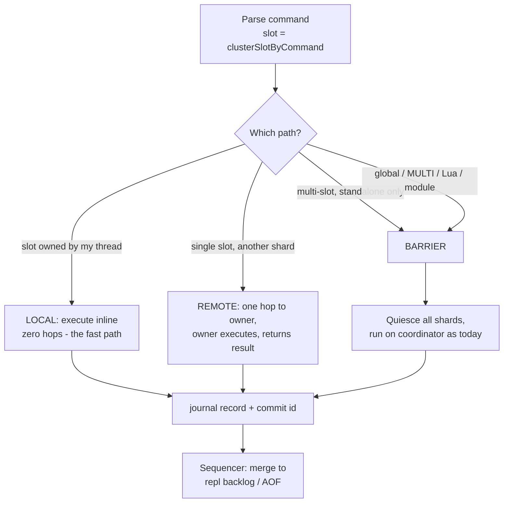

# Proposal — Slot-per-thread command execution

**Status: pre-issue draft.** Companion to
[proposal-dragonfly-inspired-perf.md](proposal-dragonfly-inspired-perf.md), which
ranks this as "Stage 4" and gates it on a Stage 0 measurement. This document is the
detailed design for that stage. It is not a commitment to build it.

---

## 1. The idea in one paragraph

Valkey's keyspace is already partitioned by hash slot: `kvstore` is an array of
hash tables, one per slot (`src/kvstore.c:294`). Today one thread executes every
command against all of them. This proposal assigns **each slot to a thread that owns
it exclusively**, so that commands touching that slot execute on that thread with no
locks and no shared mutable state. Commands that cannot be satisfied by a single
shard escalate to a barrier and run exactly as they do today.

## 2. Why this is credible for Valkey specifically

Three properties of the current code make this far less invasive than it sounds:

1. **The partition already exists.** `kvstore` is per-slot. Shard ownership is a
   mapping over an array that is already there.
2. **Cluster mode already forbids cross-slot commands.** A multi-key command whose keys
   span slots is rejected outright with `-CROSSSLOT` (`src/cluster.c:1314`), and
   `MULTI`/`EXEC` is slot-unified at EXEC time and discarded if it straddles
   (`src/cluster.c:1071-1083`). **In cluster mode, sharding by slot takes away nothing
   users have today.** This is the single most important fact in the design.
3. **Routing is already computed off the main thread.** `clusterSlotByCommand()` is
   documented as side-effect-free and safe to call from I/O threads
   (`src/cluster.c:980`), and it is already called during off-thread parsing
   (`src/server.c:4276`). The value a shard router needs is already being produced in
   the right place.

## 3. Goals / non-goals

**Goals**

- Near-linear throughput scaling with cores for single-slot commands.
- Zero behavior change at `shard-threads 1` (the default). The feature must be
  invisible until switched on.
- No new user-visible restriction in cluster mode.
- Preserve today's replication guarantees (see §7 — this is the hard part).

**Non-goals**

- A VLL/Calvin-style distributed transaction manager. The escalation barrier (§6)
  covers multi-shard work correctly, if not optimally. VLL is a later optimization,
  behind the same interface, only if profiling demands it — designed out in
  [proposal-vll-transactions.md](proposal-vll-transactions.md).
- Fibers, io_uring, or a new hash table. Orthogonal; see the companion doc.
- Making a single hot *key* faster. Nothing here helps that, and §11 is honest about it.

## 4. Ownership model

```text
             slot 0 ..... 16383            (already exists: kvstore)
             +---+---+---+---+---+---+
db->keys     | 0 | 1 | 2 | 3 |...|16383|   array of hashtables
             +---+---+---+---+---+---+
               |   |   |   |       |
   slot_to_shard[] maps each slot to exactly one owner
               |   |   |   |       |
          +----v---v-+ +-v---v-----v----+
          | shard 0  | |    shard 1     |   ... shard N-1
          | thread   | |    thread      |
          +----------+ +----------------+
```

- A **shard** is a thread plus the set of slots it owns. Ownership is exclusive:
  the owning thread reads and writes those hashtables without locks.
- `slot_to_shard[16384]` is a plain array, read-mostly. It changes only under a
  barrier (§6), which makes it safe to read lock-free from any thread.
- **Standalone mode gets virtual slots.** Today standalone sets `slot_count_bits = 0`
  (`src/server.c:2894`) — one hashtable per db. This proposal makes standalone use the
  same 16384-way `kvstore`, hashing keys to *virtual* slots used purely for routing,
  with no cluster semantics attached. This unifies the two modes on one code path and,
  as a free side effect, fixes standalone's giant-rehash problem (see the companion
  doc's dashtable discussion).

## 5. Execution paths

Each client has a **home thread** (its socket, its input buffer, its reply buffer). The
home thread acts as the command's **coordinator**. It never touches another shard's
data directly.



**LOCAL** is the case that matters. With `shard-threads` equal to the core count and a
client distribution that mirrors the slot distribution, most commands should land here
and pay *nothing* — no queue, no atomic, no cache-line bounce. Client-to-shard affinity
should be a first-class tuning goal, not an afterthought: a cluster-aware client already
knows which node owns a slot, and the same idea applies within the process.

**REMOTE** costs one queue hop each way. The existing `io_threads` queue primitives
(`src/queues.c`, SPSC/SPMC/MPSC) are the right transport — this is what they are for.
The owning shard executes and hands back a result; the coordinator formats the reply,
so reply buffers stay single-owner and per-client reply ordering is preserved for free
(the coordinator processes a client's commands sequentially, as today).

### 5a. Connection management — how Dragonfly does it, and what Valkey would owe

The coordinator model above is the skeleton; Dragonfly's connection layer fills in the
mechanics, and two of them are load-bearing enough to name explicitly. (Vendor-sourced
from Dragonfly's helio/`Connection` design; struct names **(approx)**, the model is the
point.)

- **A thread is both a connection host and a data shard.** Dragonfly's proactor threads
  each own a set of client sockets *and* a keyspace slice. When a command runs, the
  connection's thread is the coordinator and the owning shard may be itself (LOCAL) or a
  peer (REMOTE) — exactly the split above. A connection is pinned to one **home thread** on
  accept (Dragonfly picks it for NIC/CPU locality) and all of its socket I/O, parsing, and
  **reply formatting happen only there** — which is *why* reply buffers stay single-owner:
  a shard executing a remote hop hands back a result, never touching a socket it doesn't own.

- **Fibers are what make the REMOTE hop non-blocking.** Each connection is a **fiber**, not
  a thread; one proactor multiplexes thousands of them cooperatively. When a coordinator
  awaits a remote shard, its fiber *yields* and the thread runs another connection
  meanwhile. So "one queue hop each way" costs a fiber suspend/resume, not a blocked thread.
  **Valkey has no fiber runtime.** The coordinator here would instead register a
  continuation and return to the event loop (the reply is assembled in a callback when the
  shard acks) — more callback plumbing than a fiber yield, and the piece of this proposal
  with no existing Valkey analog to lean on.

- **Connection migration is how "affinity" (above) becomes real.** Dragonfly can *move a
  connection to a different thread* when its traffic overwhelmingly targets one shard, so
  its commands become LOCAL — and to rebalance load across proactors. This is the runtime
  mechanism behind the "client-to-shard affinity as a first-class goal" line above:
  **without migration, a badly-placed client pays a REMOTE hop on every command**, and
  static placement alone won't fix a client whose hot slot lives on another thread. A Valkey
  port that wants the LOCAL-path win in practice — not just in benchmarks with hand-placed
  clients — has to build connection migration, and moving a live connection between event
  loops (its socket, partial input buffer, pending replies, blocking state) is genuinely
  fiddly. Treat it as part of the scope, not a later polish.

- **Pipeline squashing** amortizes the hop for pipelined clients: Dragonfly batches a
  pipeline and dispatches grouped hops per shard once, rather than one hop per command —
  the natural mitigation for §11's "cross-thread hop is a real per-command tax" at the low
  end.

## 6. The escalation barrier

Anything that cannot be expressed as "one shard, one command" escalates:

- multi-slot commands (standalone only — cluster rejects them already)
- `MULTI`/`EXEC`, Lua scripts, functions
- module command invocations (initially all of them)
- `FLUSHALL`, `SWAPDB`, `DEBUG`, `SCAN`-family fallbacks, `RANDOMKEY`
- slot→shard rebalancing, and cluster slot migration

Protocol: the coordinator broadcasts a barrier request; each shard finishes its current
command, acks, and parks; the coordinator then runs the command **with the entire
keyspace visible, on one thread, exactly as Valkey does today**; then releases.

This is deliberately dumb. Its virtue is that **every hard command keeps running through
today's code, unchanged and already tested.** It converts a research project into an
engineering project. It is strictly slower than VLL for multi-shard work, and that is an
accepted, measurable, and *later-fixable* cost.

`SCAN` deserves a note: it need not take a barrier. The `kvstore` cursor already encodes
the table index, so `SCAN` already walks table by table. A shard-aware `SCAN` that fans
out and merges is close to free, and should be done rather than escalated.

## 7. Replication and AOF ordering — the crux

**This is the part that decides whether the design is viable.** Everything else is
mechanical.

Today the replication stream is a single totally-ordered command stream produced by one
thread (`propagateNow`, `src/server.c:3626` → `replicationFeedReplicas`,
`src/replication.c:579`), and replicas apply it single-threaded. N shard threads
producing writes concurrently have no such order.

**The naive fix and why it is not enough.** One is tempted to say: concurrent commands
touch disjoint keys, disjoint writes commute, therefore *any* merge order is a valid
serialization and we can merge shard journals in arrival order. The final state is
indeed identical. **But it silently weakens a guarantee that exists today**: if one
client issues `SET a 1` then `SET b 1` on different shards, an arrival-order merge lets a
replica observe `b=1` without `a=1`. Today that is impossible. Per-client causality
across keys is a real property that real applications depend on, and quietly dropping it
would be the kind of change that produces bug reports for years.

**The design.** Preserve a total order that is consistent with execution:

- A single **commit-id** counter (one atomic). A shard stamps a journal record with the
  next commit id **when it finishes executing** the command.
- Each shard appends its records to its own local journal ring — no contention.
- A **sequencer** drains the shard rings and emits records into the replication backlog
  and AOF **in commit-id order**, using a small reorder buffer to fill gaps.

Per-key order is preserved because one shard owns a key and its ring is FIFO. Per-client
order is preserved because the coordinator does not dispatch a client's command *k+1*
until *k* has completed — so *k* has already taken a lower commit id. The sequencer
assigns replication offsets at merge time, which keeps `master_repl_offset`, PSYNC, and
`WAIT` working on their existing contract.

> **This same journal is what makes a forkless snapshot coherent across shards.** Per
> [09-dragonfly-snapshot-model.md](09-dragonfly-snapshot-model.md), a per-shard snapshot
> establishes only a *per-shard* cut, not a global instant — so full sync is
> "each shard's point-in-time base + the journal after that shard's cut." The commit-id
> sequencer above **is** that journal layer. In other words, once slot-per-thread has
> the sequencer, the cross-shard consistency half of forkless snapshotting is already
> paid for; only the per-entry version stamp + serialize-before-mutate hook remain.

The cost is one shared atomic per write plus a reorder buffer that can stall on a gap.
Both are batchable. **A relaxed arrival-order mode could be offered as an explicit
opt-in** for users who genuinely don't need cross-key causality — but it must be opt-in
and loudly documented, never the default.

**Prototype this before writing any shard-threading code.** A standalone harness — N
concurrent disjoint-key writers, a sequencer, a replay check that the merged stream
reconstructs an identical keyspace *and* never violates per-client order — is cheap, and
if it doesn't hold up the whole proposal is dead. Learning that in a week beats learning
it in a year.

## 8. The rest of the system

| Area | Today | Under slot-per-thread |
|---|---|---|
| **Blocking** (`BLPOP`) | `server.ready_keys` + `handleClientsBlockedOnKeys()` (`src/blocked.c:383`) | Ready-key lists become per-shard. The shard that makes a key ready notifies the blocked client's coordinator via the existing queues. |
| **Expiry** | `activeExpireCycle` sweeps all slots | Per-shard cycles over owned slots. Naturally parallel; the lazy-expire path is already local to the key's shard. |
| **Eviction** | Global sampling + eviction pool (`src/evict.c:404`) | Per-shard eviction against a global `maxmemory` atomic with per-shard slack, to avoid a shared counter on the hot path. |
| **Pub/Sub** | Global | Channels are not keys; route through the coordinator. Sharded pub/sub maps to slots naturally. |
| **Keyspace notifications** | Emitted inline | Emitted by the owning shard; ordering follows the commit-id stream. |
| **`SCAN`/`DBSIZE`/`KEYS`** | Walk the kvstore | Fan out per shard, merge. `kvstore`'s cursor already encodes the table index. |
| **Modules** | Single-threaded, GIL | **Hardest surface.** Initially: every module command escalates. An opt-in "shard-safe" flag can come later. |
| **Cluster slot migration** | `design-docs/atomic-slot-migration.md` | Slot ownership now also means *thread* ownership; migration must take a barrier to reassign. |
| **Replica applying from primary** | `obey_client` bypasses slot checks (`src/server.c:4455`) | The apply path can touch any slot. Apply on a coordinator under barrier, or route per-record by slot. Needs its own design. |

## 9. Configuration

- `shard-threads N` — default `1`, which **must** be bit-for-bit today's behavior.
  The feature ships dormant.
- Slots are assigned to shards contiguously at startup. `slot_to_shard[]` is rebalanceable
  under a barrier, which is cheap: moving a slot between threads is moving a hashtable
  pointer, not moving data. This is the mitigation for a hot *slot* (§11).

## 10. Phasing

Each step is independently shippable and independently valuable.

1. **Prove the ordering model.** The §7 harness. No server changes. Do this first; it is
   the only step that can kill the project.
2. **Introduce `slot_to_shard[]` with `shard-threads 1`.** Pure refactor. Every command
   is LOCAL. Should be a runtime no-op and fully testable against the existing suite.
3. **Virtual slots for standalone.** Unifies the routing path; independently fixes
   standalone's rehash spike. Watch `SCAN` cursor semantics and `RANDOMKEY`.
4. **Multi-threaded single-key reads.** No journal, no propagation — a much smaller
   correctness surface. This alone is most of the read-heavy win.
5. **Single-key writes** + per-shard journals + the sequencer.
6. **Per-shard expiry and eviction.**
7. *(Only if measured)* Replace the barrier with VLL-style per-shard transaction queues —
   [proposal-vll-transactions.md](proposal-vll-transactions.md).

If the project stalls after step 4, Valkey still has multi-threaded reads and a fixed
standalone rehash. That is a good place to be stranded.

## 11. Honest risks

- **Hot slots.** Slots are not uniformly hot. One hot slot pegs one thread while the rest
  idle, capping throughput at one core for that workload — where today's single thread at
  least served everything at uniform cost. Slot rebalancing (§9) helps a hot *slot*;
  **nothing here helps a hot** ***key***. This is the sharpest regression class and it must
  be measured against real traffic, not uniform benchmarks.
- **The cross-thread hop is a real per-command tax.** Today the client and its data are on
  the same thread. A REMOTE command pays a queue hop each way. **At low core counts or low
  concurrency, this design is slower than today.** It must not be the default, and its
  break-even point must be published.
- **Standalone multi-key commands regress.** `MGET a b c` spanning shards runs inline today
  and takes a barrier under this design. Cluster mode gets scaling nearly for free;
  standalone does not. Cluster mode should be the first target.
- **Modules.** The API promises single-threaded execution. Escalating every module command
  is correct but could make module-heavy workloads *slower* than today.
- **Blast radius.** This touches networking, propagation, replication, expiry, eviction,
  blocking, cluster, and modules. It is a multi-year program, not a feature.

## 12. What would make me abandon this

Written down in advance, so it can't be rationalized away later:

- Stage 0 shows keyspace work is a **minority** of main-thread time at saturation
  (Amdahl caps the whole thing).
- The §7 harness shows per-client causality cannot be preserved at acceptable cost.
- Real-traffic slot distributions turn out to be hot enough that hot-slot capping negates
  the scaling in practice.

Any one of these means Valkey's existing I/O-threads bet was the right call, and the
honest conclusion is to stop.

## 13. Code anchors

| Thing | Where |
|---|---|
| Per-slot kvstore | `src/kvstore.c:294`; `slot_count_bits` `src/server.c:2894` |
| Slot routing (I/O-thread safe) | `src/cluster.c:981`, called at `src/server.c:4276` |
| `-CROSSSLOT` / MULTI slot unification | `src/cluster.c:1314`, `src/cluster.c:1071-1083` |
| Cluster redirect gate in dispatch | `src/server.c:4455` |
| Propagation | `src/server.c:3626` (`propagateNow`), `src/server.c:3680` (`alsoPropagate`) |
| Replication feed | `src/replication.c:579`, `src/replication.c:449` |
| Blocking / ready keys | `src/blocked.c:383` |
| Eviction | `src/evict.c:404` |
| Queue primitives to reuse | `src/queues.c`, `src/io_threads.c` |
