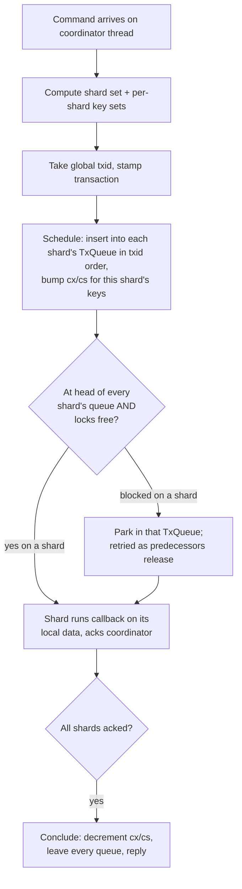
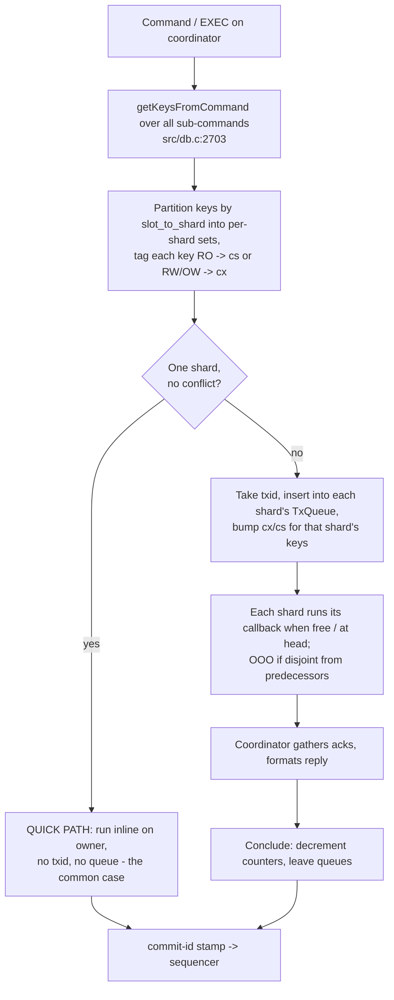

# Proposal — VLL-style transactions (replacing the escalation barrier)

**Status: pre-issue draft.** This is the detailed writeup of **step 7** of
[proposal-slot-per-thread.md](proposal-slot-per-thread.md) — "replace the barrier with
VLL-style per-shard transaction queues" — and of the non-goal that proposal deliberately
deferred (§3: "A VLL/Calvin-style distributed transaction manager… is a later
optimization, behind the same interface, only if profiling demands it").

Like [09-dragonfly-snapshot-model.md](09-dragonfly-snapshot-model.md), the first half is
a study of **Dragonfly's** design and carries "the vendor says so" confidence, not "I
read the Valkey code." The second half maps it onto Valkey and uses verified `file:line`
anchors.

Do not read this before slot-per-thread. VLL is meaningless without the shard model that
proposal builds; it is the thing you reach for *only* once the barrier's cost is
measured and shown to matter.

---

# Part A — How VLL works, and how Dragonfly uses it

## A1. The problem VLL solves

Classic two-phase locking keeps a **lock manager**: a hash table mapping each record to a
lock object with owner info and a FIFO wait queue. On a main-memory database this
structure is a disaster in miniature —

- it costs more memory than the data it protects for small records,
- every lock/unlock hits a shared, latched hash table (cache-line bouncing across cores),
- and the wait queues are pointer-chasing linked lists touched under contention.

For an in-memory KV store where the "transaction" is usually one command over a handful
of keys, the bookkeeping dwarfs the work.

**VLL — Very Lightweight Locking** (Ren, Thomson, Abadi, VLDB 2013) — throws the lock
manager away and replaces every per-record lock object with **two integers**:

- `cx` — count of transactions currently requesting/holding this record **exclusive**
- `cs` — count requesting/holding it **shared**

That is the entire per-record lock state. No wait queues hang off records.

## A2. The mechanism

Two rules do all the work:

1. **Acquire the whole write/read set at once, in one critical section.** A transaction,
   at the moment it enters the system, bumps `cx`/`cs` for *every* record it will touch —
   in a single pass, no incremental lock acquisition, so no deadlock is ever possible (no
   hold-and-wait). It is also appended to a single global ordered list, the **`TxnQueue`**.

2. **A transaction is *free* — runnable right now — iff it did not queue behind a
   conflict on any of its records.** Concretely, at acquire time:
   - a **shared** request on record *r* is free if `cx == 0` *before* it bumped `cs`
     (no writer ahead of it),
   - an **exclusive** request on *r* is free if `cx == 0 && cs == 0` *before* it bumped
     `cx` (nothing ahead of it at all).

   If all of a transaction's records were free, it runs immediately, then releases
   (decrement the counters) and leaves the queue. If any record was contended, the
   transaction stays parked in the `TxnQueue`.

Blocked transactions are retried **from the front of the queue** as earlier transactions
release their counts. Because the queue is a total order and locks were all acquired
atomically, the front transaction is guaranteed to eventually become free — the order in
the queue *is* the serialization order. The two counters tell you *whether* you conflict;
the queue tells you *who wins* when you do.

The elegance: the common case — a transaction whose records are all uncontended — reads
two integers per key, finds them zero, runs, and decrements. No queue insertion cost is
ever paid on the records themselves; the expensive structure (the queue) is only consulted
by transactions that actually block.

## A3. What Dragonfly changed to make it fit a KV store

Dragonfly is **shared-nothing, thread-per-core**: the keyspace is split into **shards**,
each pinned to one thread, each the *sole* owner of its slice. This changes VLL's
character in three ways.

**1. The lock counters live in a per-shard table, and are touched only by that shard's
thread.** Because a shard is single-threaded, incrementing `cx`/`cs` needs **no atomics
and no latches** — the thing VLL was designed to make cheap (contended lock-manager
access) becomes literally free, because there is no cross-thread access to the lock state
at all. VLL's two-integer design is what makes this per-shard table small enough to be
worth keeping. Keys with no live intent are not in the table.

**2. The `TxnQueue` becomes per-shard (`TxQueue`), ordered by a global `txid`.** A single
process-wide atomic hands out a monotonically increasing transaction id at schedule time.
Each participating shard inserts the transaction into *its own* `TxQueue` in `txid` order.
So there is no single global queue latch — there are N independent queues, and the shared
`txid` counter is the only global synchronization point, touched once per transaction, not
once per key.

**3. Execution runs as "hops."** A transaction coordinates across shards by message
passing (fibers on each thread's proactor). A **hop** is: the coordinator arms a callback
on each participating shard; each shard, when the transaction reaches the head of its
`TxQueue` and its locks are free, runs the callback against its local data and acks. Most
commands are **single-hop** — schedule, run the one callback everywhere, conclude — in one
round trip. Multi-hop is for things like `BLPOP` that must look, then act.

## A4. The optimizations that actually carry the performance

Plain VLL is correct but Dragonfly's speed comes from the special cases that *skip* it:

- **Single-shard quick path.** A command touching keys on exactly one shard, arriving at a
  shard whose queue is empty and whose keys show no conflicting intent, runs **inline** —
  no `txid`, no queue insertion, no hop machinery. This is the overwhelming majority of
  real traffic (`GET`, `SET`, `INCR` on one key) and it pays essentially nothing. This is
  the single most important optimization; VLL is the fallback, not the hot path.

- **Out-of-order (OOO) execution.** A transaction not at the head of a shard's queue may
  still run early **if its keys don't conflict with anything ahead of it** — the `cx`/`cs`
  counters detect exactly this. The strict `txid` order is only *forced* between
  transactions that actually contend. Disjoint-key transactions commute, so a shard drains
  its queue as a partial order, not a line.

- **Batched scheduling.** Under load a shard schedules and concludes many transactions per
  wakeup, amortizing the fiber/dispatch overhead.

The takeaway for anyone porting this: **VLL is not what makes Dragonfly fast; the quick
path is.** VLL exists so that the *rare* multi-key, multi-shard transaction is correct and
non-blocking-for-the-disjoint-case, without a heavyweight lock manager, and without ever
slowing down the single-key path that dominates.

## A5. Confidence

The two-counter VLL core is from the VLDB paper. The shard/`TxQueue`/`txid`/hop model, the
single-shard quick path, and OOO execution are from Dragonfly's own writeups and source
(links in §B9). Exact struct names and whether OOO is on by default for every command
class are **(approx)** — verify against `src/server/transaction.{h,cc}` before relying on
specifics.

---

# Part B — How it maps onto Valkey

## B1. Where this plugs in

The slot-per-thread proposal (§6) handles every multi-shard command with an **escalation
barrier**: quiesce all shards, run the command single-threaded exactly as Valkey does
today, release. That is deliberately dumb, deliberately correct, and — for a workload with
many cross-shard `MULTI`/`EXEC`, Lua scripts, or standalone multi-key commands —
deliberately slow: **one such command stalls every shard**, so throughput collapses to
serial for the duration.

VLL replaces that global stall with **fine-grained, per-key intent locks**, so a
cross-shard transaction blocks *only* the shards and keys it actually touches, and
disjoint transactions on other shards keep running. Same external behavior; the barrier's
"stop the world" becomes "lock the rows."

Crucially, this sits **behind the same interface** slot-per-thread already defines. Nothing
above the executor needs to know whether a multi-shard command took a barrier or a VLL
schedule. That is what makes this a later, optional, measurement-gated step rather than a
prerequisite.

## B2. Valkey already computes the read/write set — for free

VLL's precondition is knowing every key a command will touch *before* running it. In many
databases that is a hard static-analysis problem. **In Valkey it is already solved and
already on the hot path:** every command declares its keys via key specs, and
`getKeysFromCommand()` extracts them.

| VLL needs | Valkey already has | Anchor |
|---|---|---|
| The set of keys a command touches | `getKeysFromCommand()` → `getKeysResult` | `src/db.c:2703` |
| Key extraction via declarative specs | `getKeysUsingKeySpecs()` / `…WithSpecs()` | `src/db.c:2393`, `src/db.c:2523` |
| Read-vs-write per key (→ `cs` vs `cx`) | key-spec flags (`CMD_KEY_RO`/`RW`/`OW`) | key spec definitions |
| Which shard owns a key | slot → `slot_to_shard[]` (from slot-per-thread) | proposal §4 |

So the read/write set and its shared/exclusive split come straight out of the command
table. This is a genuine structural advantage over Dragonfly, which had to build its key
extraction from scratch — Valkey's has existed since the key-specs refactor and is used by
cluster routing and ACLs today.

`MULTI`/`EXEC` is the interesting case: `execCommand()` (`src/multi.c:195`) already has the
**entire** queued command vector in hand before it runs the first command (it saves
`orig_argv`/`orig_argc` at `src/multi.c:238`). So the union of all queued commands' keys —
the transaction's full write set — is computable up front by looping `getKeysFromCommand()`
over the queued commands. That union is exactly what a VLL transaction needs to lock in one
pass.

## B3. WATCH is a hint that Valkey's model is already halfway there

Valkey's optimistic `WATCH`/`MULTI`/`EXEC` already maintains per-key transactional state:
`watchForKey()` (`src/multi.c:362`) registers interest in a key, `touchWatchedKey()`
(`src/multi.c:464`) fires when it changes, and `isWatchedKeyExpired()` /`EXEC` aborts on
conflict (`src/multi.c:207`). That is optimistic concurrency control keyed per-key — the
*mirror image* of VLL's pessimistic per-key counters.

The point is not that WATCH becomes VLL. It is that **Valkey already has a per-key
transactional-intent table** (the watched-keys dict on the db). A VLL intent-lock table is
the same shape of structure — key → small per-key record — living on each shard. The data
structure is familiar; only the semantics (pessimistic counts vs. optimistic version
watch) differ.

## B4. The design

Per shard (each owned by one thread, per slot-per-thread's model), add:

- an **intent table**: `key → {cx, cs}`, present only for keys with live intent. Because
  the owning thread is the *only* accessor, increments are plain integer ops — no atomics,
  exactly as in Dragonfly (§A3).
- a **`TxQueue`**: transactions scheduled on this shard, ordered by a global `txid`.

Process-wide, add one atomic **`txid`** counter. Reuse slot-per-thread's existing
cross-thread **queue primitives** (`src/queues.c`) as the hop transport — the coordinator
arms callbacks on shards and collects acks over the same SPSC/MPSC rings the REMOTE path
already uses.

Command flow:

The **QUICK PATH** is B2's payoff: a single-key or single-shard command never enters the
VLL machinery at all — it is exactly slot-per-thread's LOCAL/REMOTE path. VLL is entered
*only* for genuinely multi-shard transactions, i.e. precisely the commands that take a
barrier today.

## B5. This composes with the commit-id sequencer — it does not fight it

Slot-per-thread §7 already requires a **commit-id sequencer**: each write is stamped with a
global commit id when it finishes, and a sequencer merges shard journals into the
replication/AOF stream in commit-id order, preserving per-key and per-client causality.

VLL slots in cleanly: a VLL transaction concludes at a well-defined point (all shards
acked), so it takes its commit id **at conclude**, atomically for the whole transaction.
Multi-shard commands thus appear in the replication stream as an atomic, correctly-ordered
unit — which is exactly the guarantee `MULTI`/`EXEC` promises today and the guarantee the
barrier preserves by brute force. **The barrier and VLL produce the same journal; VLL just
produces it without stopping the world.** So no replication redesign is needed on top of
what slot-per-thread already signs up for.

## B6. What VLL buys, concretely

| Workload | Barrier (slot-per-thread §6) | VLL (this doc) |
|---|---|---|
| Single-key `GET`/`SET` | LOCAL, no barrier | identical quick path — VLL not entered |
| Cross-shard `MGET a b` (standalone) | all shards quiesce | locks 2 keys; other shards run |
| Cross-shard `MULTI`/`EXEC` | all shards quiesce for the whole EXEC | locks the EXEC's key set; disjoint txns proceed |
| Two disjoint cross-shard txns | serialized (barrier is global) | run concurrently (OOO / disjoint queues) |
| Lua touching declared keys | all shards quiesce | locks declared keys; rest of keyspace live |

The win is entirely at the tail: it converts "any multi-shard command is a global stall"
into "a multi-shard command is a per-key lock." If multi-shard commands are rare in the
target workload, **the barrier is already fine and this whole doc is wasted effort** — see
§B8.

## B7. The hard parts Valkey-specific

- **Lua and modules touch undeclared keys.** VLL's whole premise is a known write set. A
  script that computes key names at runtime, or a module command that touches arbitrary
  keys, has no static set to lock. **These must still escalate to the barrier.** VLL does
  not replace the barrier; it *narrows its scope* to commands with a declarable key set.
  `EVAL` with declared `KEYS` is fine; `EVAL` that constructs keys from data is not. This
  boundary must be drawn explicitly and conservatively (default: unknown ⇒ barrier).

- **`WATCH` semantics under threading.** Today `touchWatchedKey()` runs inline on the one
  thread. With per-shard ownership, a watched key and the `WATCH`ing client's coordinator
  may be on different threads; the touch notification must route through the coordinator
  (same issue as blocking keys in slot-per-thread §8). VLL doesn't create this problem, but
  it lives in the same code and must be solved together.

- **Deadlock-freedom depends on all-at-once acquisition.** VLL is deadlock-free *only*
  because a transaction acquires its entire set in one pass. Any code path that acquires
  incrementally (a multi-hop command that discovers a new key mid-execution, e.g. a
  `BLPOP`-style look-then-act) breaks that invariant. Dragonfly handles this with explicit
  multi-hop transaction types; Valkey would need the same discipline, and it is easy to get
  wrong.

- **Key-spec completeness.** VLL correctness now *depends* on `getKeysFromCommand()` being
  exhaustive — a command that touches a key it doesn't declare would run unlocked and
  corrupt the serialization. Today an incomplete key spec is a cluster-routing/ACL bug;
  under VLL it becomes a **correctness** bug. This raises the stakes on key-spec accuracy
  and argues for a fuzz/audit pass over the command table before enabling VLL.

## B8. Phasing — and why this is last

This is **step 7** of slot-per-thread's phasing for a reason: every earlier step delivers
value on its own, and this one only pays off once (a) the shard model exists and works, and
(b) measurement shows multi-shard commands are a real bottleneck.

1. Ship slot-per-thread through its step 6 (per-shard expiry/eviction) with the barrier.
2. **Measure the barrier's actual cost** on the target workload: what fraction of commands
   escalate, and what tail latency / throughput loss the global stall causes.
3. Only if that cost is material: build the per-shard intent table + `TxQueue`, entered
   *only* by commands with a declarable multi-shard key set. Everything else keeps taking
   the barrier.
4. Add OOO execution *only* if step-3 profiling shows head-of-queue blocking on disjoint
   transactions is itself a bottleneck. Plain in-order VLL may be enough.

Each step is independently abandonable. Stopping after step 1 leaves a correct, complete
system — just with a coarse multi-shard path.

## B9. What would make me abandon this

Written down in advance:

- **The barrier is cheap enough.** If Stage-0-style measurement shows multi-shard commands
  are a small fraction of traffic (likely true in cluster mode, where cross-slot commands
  are already forbidden — slot-per-thread §2), the global stall almost never fires and VLL
  buys nothing. **This is the most probable outcome for cluster deployments, and it is a
  fine outcome.** VLL's whole reason to exist is standalone multi-key traffic and
  cross-shard `MULTI`/`EXEC`, which cluster users mostly don't have.
- **Key-spec accuracy can't be guaranteed.** If auditing the command table shows key specs
  aren't trustworthy enough to make VLL's correctness depend on them, the barrier's "just
  run it single-threaded" is safer and should stay.
- **The multi-hop / undeclared-key surface (Lua, modules, blocking) is so large** that most
  interesting transactions escalate anyway, leaving VLL to optimize a thin slice.

Any one of these means the barrier was the right call and the honest conclusion is to keep
it. This doc exists so the option is designed and understood — not so it gets built by
default.

## B10. Code anchors

| Thing | Where |
|---|---|
| Key extraction (VLL's read/write set) | `getKeysFromCommand` `src/db.c:2703` |
| Key extraction via specs | `getKeysUsingKeySpecs` `src/db.c:2393`; `…WithSpecs` `src/db.c:2523` |
| `MULTI`/`EXEC` full command vector in hand | `execCommand` `src/multi.c:195`, `orig_argv` `src/multi.c:238` |
| Optimistic per-key intent (WATCH) | `watchForKey` `src/multi.c:362`, `touchWatchedKey` `src/multi.c:464`, abort `src/multi.c:207` |
| Shard ownership / routing | slot-per-thread §4, `slot_to_shard[]` |
| Commit-id sequencer VLL stamps into | slot-per-thread §7 |
| Cross-thread hop transport to reuse | `src/queues.c`, `src/io_threads.c` |

## B11. Sources (Dragonfly / VLL — vendor + paper, not Valkey code)

- Ren, Thomson, Abadi — *Lightweight Locking for Main Memory Database Systems*, VLDB 2013.
- Dragonfly — transaction framework docs / blog and `src/server/transaction.{h,cc}`
  (verify struct names and OOO defaults against source; §A5).
- Companion: [09-dragonfly-snapshot-model.md](09-dragonfly-snapshot-model.md) (the journal
  layer VLL's commit stamps feed) and
  [proposal-slot-per-thread.md](proposal-slot-per-thread.md) (the shard model VLL requires).
</content>
</invoke>
